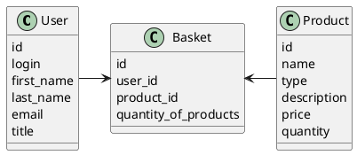

# Компонентная архитектура
<!-- Состав и взаимосвязи компонентов системы между собой и внешними системами с указанием протоколов, ключевые технологии, используемые для реализации компонентов.
Диаграмма контейнеров C4 и текстовое описание. 
-->
## Компонентная диаграмма

```plantuml
@startuml
!include https://raw.githubusercontent.com/plantuml-stdlib/C4-PlantUML/master/C4_Container.puml

AddElementTag("microService", $shape=EightSidedShape(), $bgColor="CornflowerBlue", $fontColor="white", $legendText="microservice")
AddElementTag("storage", $shape=RoundedBoxShape(), $bgColor="lightSkyBlue", $fontColor="white")

Person(admin, "Администратор")
Person(moderator, "Модератор")
Person(user, "Пользователь")

System_Ext(web_site, "Сайт магазина", "HTML, CSS, JavaScript, React", "Веб-интерфейс")

System_Boundary(shop_site, "Сайт магазина") {
   Container(client_service, "Сервис авторизации", "C++", "Сервис управления пользователями", $tags = "microService")    
   Container(product_service, "Сервис продуктов", "C++", "Сервис управления товарами", $tags = "microService") 
   Container(basket_service, "Сервис корзин", "C++", "Сервис управления корзинами", $tags = "microService")   
   ContainerDb(db, "База данных", "MySQL", "Хранение данных о товарах, корзинах и пользователях", $tags = "storage")
}

Rel(admin, web_site, "Просмотр, добавление и редактирование информации о пользователях, товарах и корзинах")
Rel(moderator, web_site, "Модерация корзин с товарами и пользователей")
Rel(user, web_site, "Регистрация, просмотр/изменение корзин")

Rel(web_site, client_service, "Работа с пользователями", "localhost/person")
Rel(client_service, db, "INSERT/SELECT/UPDATE", "SQL")

Rel(web_site, product_service, "Работа с товарами", "localhost/prod")
Rel(product_service, db, "INSERT/SELECT/UPDATE", "SQL")

Rel(web_site, basket_service, "Работа с корзинами", "localhost/bask")
Rel(basket_service, db, "INSERT/SELECT/UPDATE", "SQL")

@enduml
```
## Список компонентов  

### Сервис авторизации
**API**:
-	Создание нового пользователя
  - входные параметры: login, пароль, имя, фамилия, email, обращение (г-н/г-жа)
  - выходные параметры: отсутствуют
-	Поиск пользователя по логину
  - входные параметры:  login
  - выходные параметры: имя, фамилия, email, обращение (г-н/г-жа)
-	Поиск пользователя по маске имени и фамилии
  - входные параметры: маска фамилии, маска имени
  - выходные параметры: login, имя, фамилия, email, обращение (г-н/г-жа)

### Сервис продуктов
**API**:
- Создание товара
  - Входные параметры: название товара, категория, цена, количество, описание товара
  - Выходные параметры: идентификатор
- Получение списка продуктов
  - Входные параметры: отсутствуют
  - Выходные параметры: массив с продуктами, где для каждого указаны его идентификатор, название, категория, цена, количество
- Поиск пользователя по маске названию
  - входные параметры: маска названия продукта
  - выходные параметры: продуктами, для которого указаны его идентификатор, название, категория, цена, количество

### Сервис корзины
**API**:
- Добавление/удаление товара в/из корзину/ы
  - Входные параметры: товар, его количество, операция (добавить/удалить)
  - Выходные параметры: статус операции (успех/ошибка)
- Удаление корзины
  - Входные параметры: логин пользователя
  - Выходные параметры: статус операции (успех/ошибка)
- Получение корзины для пользователя
  - Входные параметры: логин пользователя
  - Выходные парамтеры: массив с товарами, где для каждого указаны его идентификатор, название, цена, количество


### Модель данных
